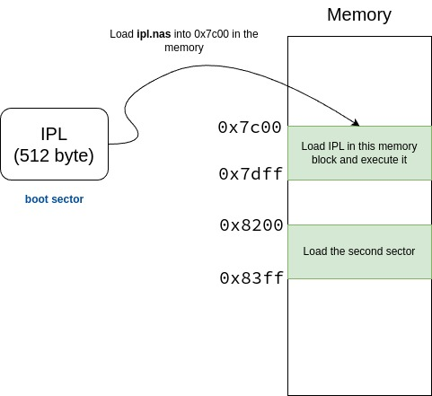

# Development Env Setup
- ```sudo apt install nasm qemu-system```

# How Initial Program Loader loads boot sector from floppy
- Load the boot sector (512 bytes) from the floppy to memory (0x7c00)
- Eexcute the program from 0x7c00 to 0x7dff
- It would load the other program in other memory address like 0x8200.



