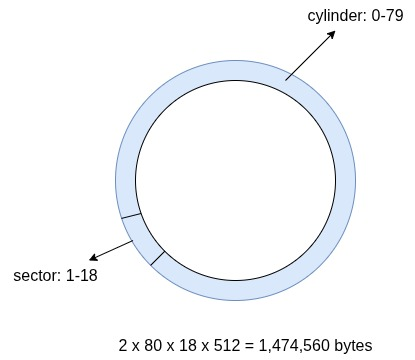

# Development Env Setup
- ```sudo apt install nasm qemu-system```

# How Initial Program Loader loads boot sector from floppy
- Load the boot sector (512 bytes) from the floppy to memory (0x7c00)
- Eexcute the program from 0x7c00 to 0x7dff
- It would load the other program in other memory address like 0x8200.


# The layout of floppy

### Reading Order for BIOS Disk Access

When performing disk reads via BIOS interrupt `0x13`, the read operation follows a specific order in addressing:

- **CL (Cylinder Low / Sector Number):** Specifies the sector number (1-based index).
- **DH (Head):** Specifies the head (or side) number of the disk.
- **CH (Cylinder High / Cylinder Number):** Specifies the cylinder (or track) number.

The BIOS processes sectors in the following hierarchical order:

**Sector (`CL`) → Head (`DH`) → Cylinder (`CH`)**

This means the BIOS:
- Iterates through all sectors of a head before moving to the next head.
- Processes all heads of a cylinder before proceeding to the next cylinder.
